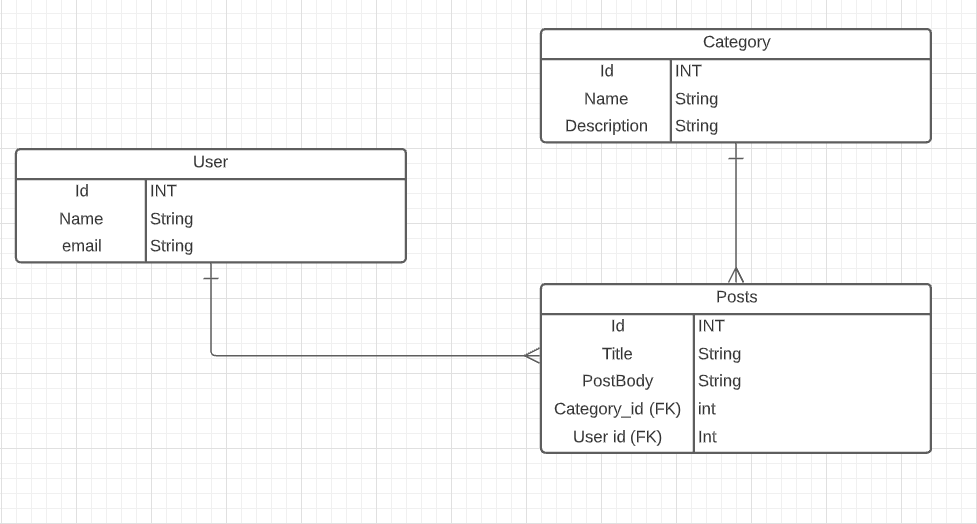
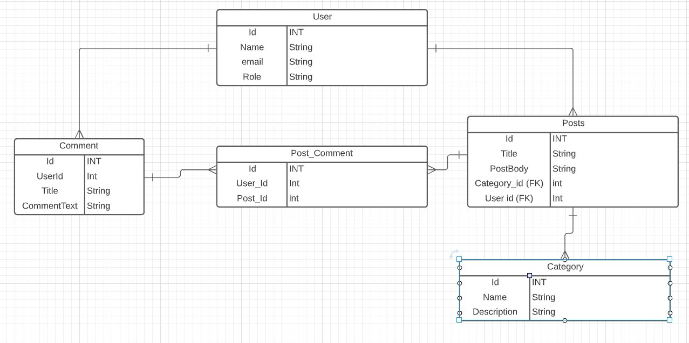

# Blog API

## User Stories

* As a user I should be able to log in and list my blog posts.
* As an author I should be able to update my posts.
* As an author I should be able to delete my posts.
* As an author I should be able to create new posts.
* As an unprivileged user I should be able to read all the posts but not make any changes.

## ERD

## Planned deliverables

* Hosted on a webserver.
* Postgres DB.
* Simple front-end.
* Some basic content.

## If I have time:

* Roles and permissions admin user can create posts.
* Regular users can comment
* Unauthenticated can only read

## Installation instructions:

* You'll need to create a postgres database
* Configure the application.properties to a privileged user on that database
* Then run the application, and you should be able to test the endpoints.

## Endpoints documentation

| Request Type | URL             | Request Body   | Request Header | Function            | Access |
|--------------|-----------------|----------------|----------------|---------------------|--------|
| GET          | /api/categories | None           | None           | List all Categories | Any    |
| POST         | /api/categories | title, content | JPA Token      | Create new category | Author |
|              |                 |                |                |                     |        |
|              |                 |                |                |                     |        |
|              |                 |                |                |                     |        |
|              |                 |                |                |                     |        |
|              |                 |                |                |                     |        |
