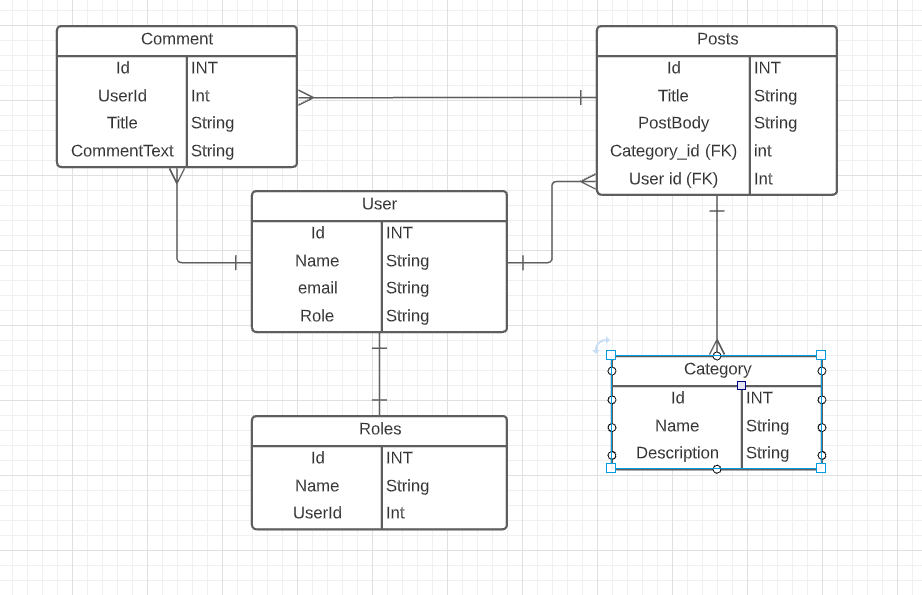

# Blog API

### General Approach
This blogApi is using the Model controller approach. It currently is using 6 models, with 6 controllers. I divided the 
project to keep it as modular as possible, with an emphasis on extensibility. 

Backed by a Postgres Database, relations are set up connecting all the relevant tables to one another. This allows 
sensible ways of getting all the data in a tree'ed format. 

I will be implementing this on a live webserver with a front-end in my spare-time once I can make it more secure. 

## ERD - Simple MVP

## ERD - Actual

## Main Features
* Password Authentication / JWT Authorization
* User roles, ADMIN, AUTHOR, USER
* Users can comment on posts
* Posts have an Author
* Integration tests
* Test have their own DB and Application.properties
----

## Unfinished features
- [ ] Comments should have the author associated.
- [ ] The security pathing for the userRoles is not 100% yet.
- [ ] I want to add dates to the posts and comments.
- [ ] Unit Tests - I currently have none. 
- [ ] Integration Tests, I have very limited test coverage at the moment. 

## Tricky bits
* Setting up the roles took a bit of research and troubleshooting.
* Getting the pathing correct for the antMatchers is still giving me some trouble.

## If I have time:

- [x] Roles and permissions admin user can create posts.(DONE!)
- [x] Regular users can comment (DONE!)
- [x] Unauthenticated can only read (DONE-ish!)

## Installation instructions:
* You'll need to create a postgres database
* Configure the application.properties to a privileged user on that database
* Everything else Maven will pull for you!
* Then run the application, and you should be able to test the endpoints.

## User Stories
* As a AUTHOR I should be able to log in and list my blog posts.
  * There should be a page that shows the currently logged in user with their posts.
* As an AUTHOR I should be able to update my posts.
  * Should only be able to edit posts created by this author.
* As an AUTHOR I should be able to delete my posts.
  * This should be only posts created by author.self
* As an AUTHOR I should be able to create new posts.
  1. Posts will have a category associated
  2. Posts will have an author associated
  3. Can lookup posts by author
  4. can lookup posts by category
* As an unprivileged user(rando) I should be able to read all the posts but not make any changes.
  * Any old rando can browse the site, but they cannot comment or change anything. 
* As an ADMIN I should be able to delete anything and change users in any way.
  * ADMINs will have access to all the destructive methods
  * ADMINs can change users roles
* As a USER I should be able to comment on posts, because the internet needs to know.
  * The USER role will be able to leave comments
  * Comments are associated with posts. 
  * Post can have many comments

## Questions I Still Have:
* When building out the front-end I ran into errors. (Blocked by CORS policy.)  It looks like the request needs some kind of header.  I'm sure it's an easy fix. I put it on the back-log since it wasn't a requirement. Need to figure that out.
* When a token is expired, and the user is trying to get to an end-point that requires no AUTH, something besides an exception should happen. Just serve it up. Don't even bother checking on those. 
----

## Endpoints documentation

| Request Type | URL                                   | Request Body      | Request Header | Function                | Access |
|--------------|---------------------------------------|-------------------|----------------|-------------------------|--------|
| GET          | /api/categories                       | None              | None           | List all Categories     | Any    |
| GET          | /api/categories/{catId}               | None              | None           | Get a specific category | ANY    |
| POST         | /api/categories                       | title, content    | JPA Token      | Create new category     | Author |
| DELETE       | /api/categories/{id}                  | None              | JPA Token      | Remove a category       | Admin  |
| GET          | /api/categories/{id}/posts/{id}       | None              | None           | Get a specific post     | Any    |
| POST         | /api/categories/{id}/posts            | title, content    | JPA Token      | Create A new post       | Author |
| PUT          | /api/categories/{id}/posts/{id}       | title, content    | JPA Token      | Update an existing post | Author |
| DELETE       | /api/categories/{id}/posts/{id}       | None              | JPA Token      | Delete a post           | Author |
| GET          | /api/users                            | None              | None           | Shows a list of users   | Any    |
| GET          | /api/{username}/posts                 | None              | None           | Shows all user posts    | Any    |
| Delete       | /api/{username}                       | None              | None           | Delete a user           | Admin  |
| Post         | /api/categories/cid/posts/pid/comment | Comment           | JPA Token      | Create a New Comment    | USER+  |
| POST         | /admin/adduserrole                    | User, Role        | JPA            | Add a role to a user    | Admin  |
| Post         | /auth/register                        | Name, email, pass | none           | Register a user         | Any    |
| Post         | /auth/login                           | name, Pass        | none           | Login a user            | ANY    |
----
## Planned deliverables
-[ ] Hosted on a webserver.
-[x] Postgres DB.
-[ ] Simple front-end.
-[ ] Some basic content.

## Technologies Used

